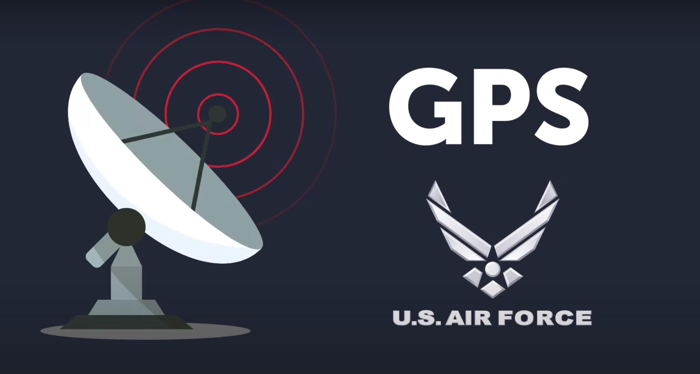
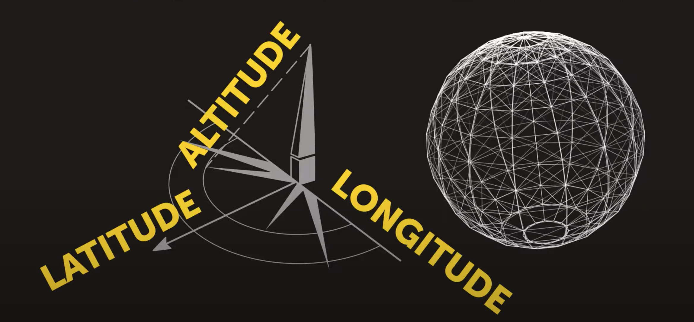

# global positioning system
- Developed by US military

- Car started using it in 1996

- Today GPS is managed by USA airforce

- GPS has three parts

- Ground station make sure satellite is on right position

- Receivers sends signal to satellite 

- GPS has 32 satellites 

- GPS has 10 years of lifecycles
- It needs regular repair
- It works for any weather
# How GPS works?
- It needs at least 4 satellites
- It is called `trilateration mechanism`
# 2-d trilateration 

- Started walking from home for one hour

- Ask farmer for clue

- Ask police for second clue

- Ask a girl for third clue

- Got your answer

# 3-d trilateration

- more satellite you used, more accurate position you get

# How distance are calculated
- Get distance based on speed of light

- Sync satellite atomic clock to receiver quartz clock

- Time moves faster for objects which is far away from gravity 

- If time problem is not solved than GPS location will be off by 6 miles every day

- time problem is solved by using four satellites

- All ground station sends the updated satellite to all receivers

- Satellite also sends most accurate time, which is used by many system (banking, receiver etc)

- Sometime GPS is not accurate :-) 

# Alternate of GPS

# Military use
- US denied GPS access data to India in June 1999
- India developed it's own `navic` (NAVigation with Indian Constellation) GPS system, mostly for areas around India
    - First launch	1 July 2013
    - 12 April 2018
    - Total satellites 9
    - Cost US$315 million), to March 2017
    - Coverage
    

# Reference 
https://www.youtube.com/watch?v=wCcARVbL_Dk

